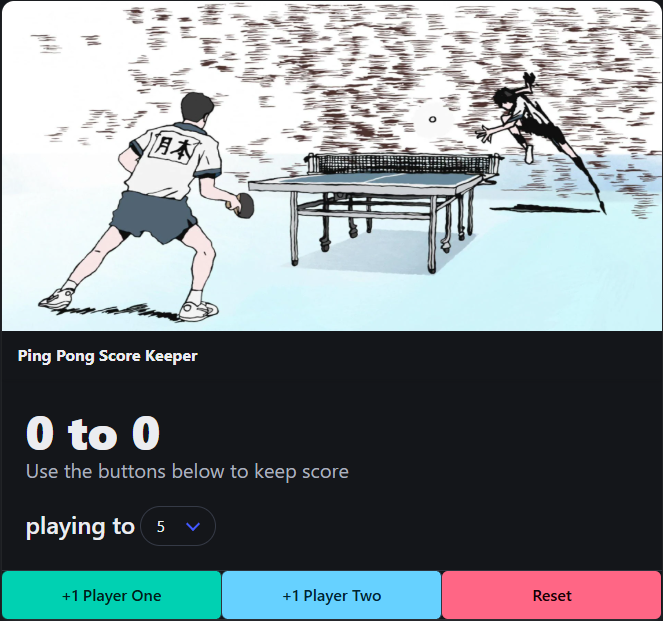

# Ping Pong Score Keeper

This is a simple and interactive Ping Pong Score Keeper web application, built as part of the curriculum for "The Web Developer Bootcamp 2025" by Colt Steele. It allows two players to keep track of their scores during a game of ping pong and declares a winner once a predetermined winning score is reached.

## Technologies Used

This project utilizes the following core web technologies:

* **HTML:** Provides the structural foundation for the web page, including elements for scores, buttons, and the winning score input. (`index.html`)
* **[Bulma](https://bulma.io/):** A modern CSS framework that provides pre-styled components and a responsive grid system, making the application visually appealing and easy to layout.
* **JavaScript:** Implements the dynamic functionality of the score keeper, handling button clicks, updating scores, checking for a winner, and managing the game state. (`app.js`)

## Features

* **Two-Player Scoring:** Allows tracking scores for two distinct players.
* **Score Increment Buttons:** Simple buttons to increase the score for each player.
* **Winning Score Input:** Users can set the target winning score for the game.
* **Winner Declaration:** Automatically announces the winner once a player reaches the winning score.
* **Reset Button:** Enables users to easily start a new game, resetting both scores and the winning score.
* **Styled with Bulma:** Leverages Bulma's pre-built CSS classes for a clean and responsive design.

## How to Use

1.  **Clone the Repository (if you haven't already):**
    ```bash
    + git clone https://github.com/MilanAnilAnthore/ScoreKeeper.git
    ```

2.  **Open `index.html` in your web browser:** Simply double-click the `index.html` file or open it using the "Open File" option in your browser (Chrome, Firefox, Safari, etc.). The Bulma CSS should be linked within this file, providing the styling.

3.  **Set the Winning Score:** "Select your desired winning score from the dropdown menu.".

4.  **Start Playing:** Use the "Player 1 +" and "Player 2 +" buttons to increment the scores for each player as the game progresses.

5.  **Winner Announcement:** Once a player's score reaches the set winning score, a message will declare them the winner.

6.  **Reset Game:** To start a new game, click the "Reset" button. This will reset both scores and the winning score to its initial state.

## Files Included

* `index.html`: The main HTML file containing the structure and the link to the Bulma CSS framework.
* `app.js`: The JavaScript file containing the logic and functionality of the score keeper.

## Potential Future Enhancements

While this is a functional score keeper, here are some ideas for potential improvements:

* **Local Storage:** Persist the winning score and/or current scores even if the browser is closed or refreshed.
* **Further Styling:** Explore more advanced Bulma components or custom CSS to enhance the visual design.
* **Game History:** Keep track of previous games and their outcomes.
* **Decrement Buttons:** Allow for accidental score increases to be corrected.

## Acknowledgements

This project was created as part of the learning experience in "The Web Developer Bootcamp 2025" by Colt Steele. The course provided valuable guidance and instruction in the fundamental concepts of web development. The styling of this application is enhanced by the use of the [Bulma CSS Framework](https://bulma.io/).


**Author:** [Milan Anil Anthore](https://github.com/MilanAnilAnthore)


Feel free to reach out if you have any questions or suggestions!


## 📸 Screenshot



